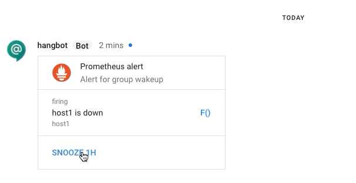

# Botanist

Botanist is a bot to alert you interactively about Prometheus alerts.
It currently works only with Google's new [Hangouts Chat](https://gsuite.google.com/products/chat/) product - but it's simple to add others ;)

## Features

## Hangouts Chat

* Receive messages via Pub/Sub topic subscription.
* Asynchronous responses via HTTP API.
* Using allot you can easily implement new commands that the Bot understands
  * If botanist does not understand your message, it will list all available commands
* Prometheus can send in alerts to alertGroups
  * Users can add/remove themselves from these groups, which match the receiver labels of alerts
  * These alertGroups are currently persistent in the config file

## Requirements

From the [Hangouts Chat](https://developers.google.com/hangouts/chat/) documentation.

* ServiceAccount for the bot. To be used for receiving messages via Pub/Sub.
* Pub/Sub topic created to be used for your Bot to receive messages.

See [this guide](https://developers.google.com/hangouts/chat/how-tos/pub-sub) for the setup instructions

## Screenshot of typical interaction

### Hangouts Chat



## Execution

``` bash
./botanist
```

You will need to create a config file for botanist - by default this is expected in the same directory as the
binary named `botanist.conf`

```yaml
---

hangouts:
    credentialsFile: /tmp/botanist_creds.json
    project: calm-vine-XXXXXX
    psSubscripton: botanist
```

while the `botanist_creds.json` can be optained from [the Google API & Services Panel](https://console.developers.google.com/apis/credentials) in the Service Accounts section.

## TODO

* Implement Slack messaging
* Implement Telegram messaging

